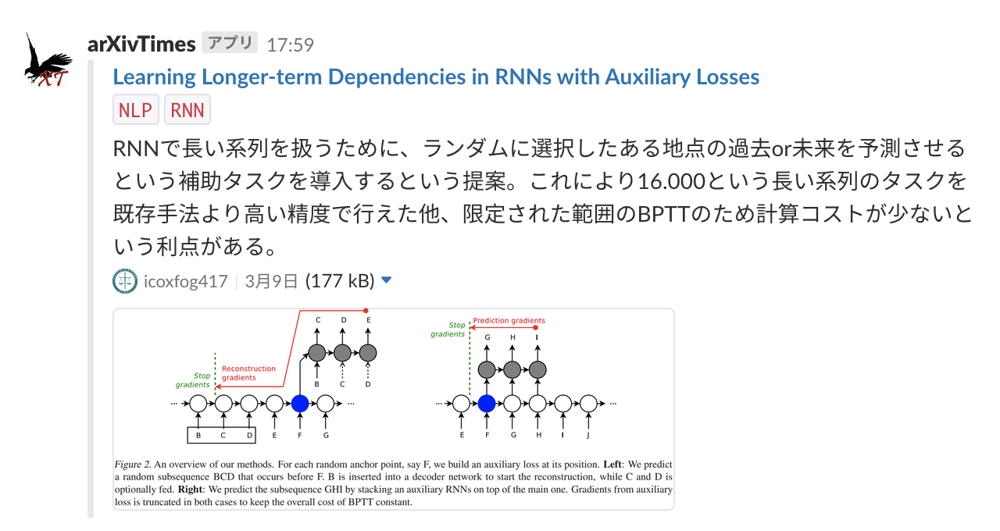

# arXivTimes
arXivTimes の新着情報を通知するアプリ



## 初期設定
- Lambda Function を作成する
  - ハンドラを `main.handler` に設定する
  - 環境変数を設定する
  - デプロイする
- Lambda Function に CloudWatch Events を紐付ける
  - 一時間に一回実行されるように設定する

## デプロイ
``` console
$ make publish [AWS_PROFILE=...]
```

## 環境変数
| Key | Value |
|---|---|
| `SLACK_INCOMING_WEBHOOK_URL` | `https://hooks.slack.com/services/XXXXXXXXX/XXXXXXXXX/xxxxxxxxxxxxxxxxxxxxxxxx` |
| `GITHUB_API_TOKEN` | |
